Windows下开发c++其实并不推荐，但是如果写一个小demo还是很快的
**注：不要在Windows下开发线程相关c++**
#### 安装vscode
vscode安装应该不是很难，bing微软官网就可以下载安装
#### 下载mingw-w64
这里推荐mingw-w64而不是mingw，主要是因为我安装mingw时候安装不上gdb也是很头疼，刚好mingw-w64将gcc/g++/gdb等都集成好了，大大提高安装效率
- 进入[mingw-w64官网](http://mingw-w64.org/doku.php/download)
- 点击sourceforge（如图）

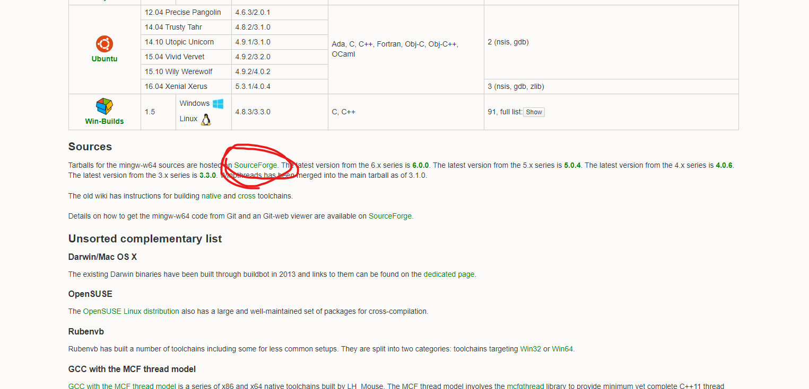
- 在[SourceForge](https://sourceforge.net/projects/mingw-w64/files/mingw-w64/mingw-w64-release/)下载MinGW-W64-install.exe（往下拉）

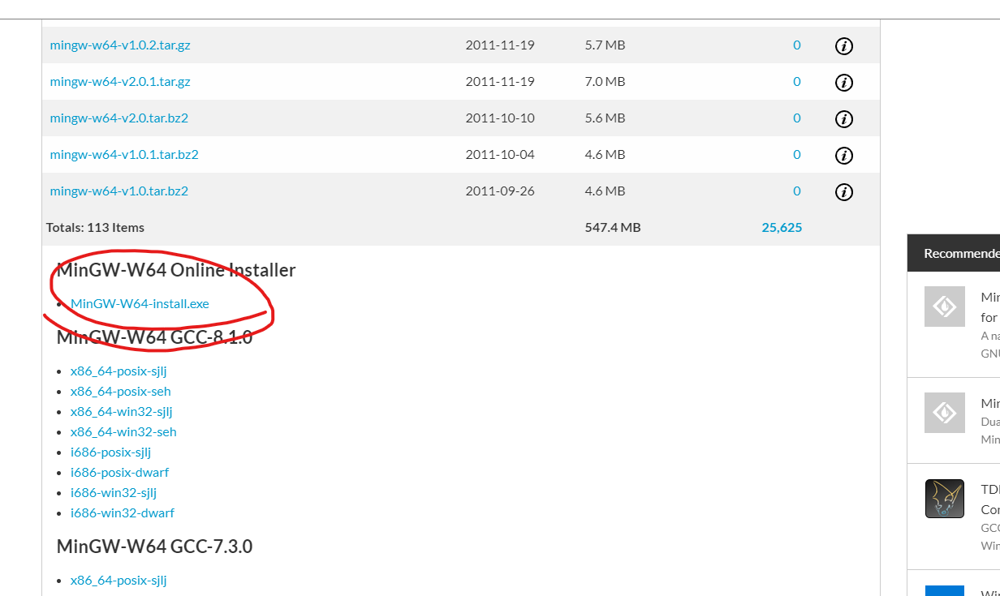
- 下载好后，可以在下载目录下看到MinGW-W64-install.exe文件
#### 安装mingw-w64
- 右键以管理员运行mingw-w64（如果不以管理员运行可能会造成无法下载情况）
- 安装目录等不多详细描述，但是要记住安装目录，安装过程有一个界面如下配置即可

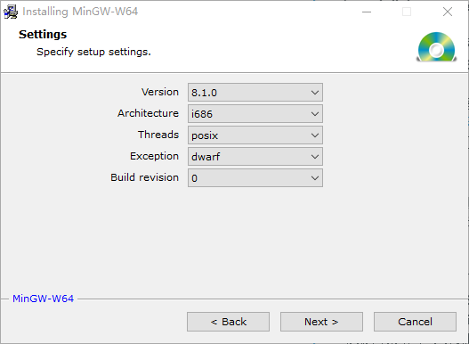
  + version：版本，一般选取最高版本即可
  + Architexture：这个选择系统位数，我们是64位所以选择x86_64，如果是32位选择i686
  + Threads:这里主要是线程使用相关，因为在win下所以选择win32，linux下选择posix，这里注意，因为选用win32时候只能在win下使用多线程，可移植性很差，所以尽量在linux或mac上写c++代码，win可以先学习用
  + exception：这个应该是异常处理，seh比较新，不支持32位，sjlj比较老支持32位，我选择seh
  + 最后这个也不知道啥用，只有一个0可选，就不管他了
- 选择好上述选项后就可以安装了，安装后可以进入安装目录bin目录下查看有g++，gcc，gdb等exe
#### 编辑系统变量
添加安装目录到系统变量path中

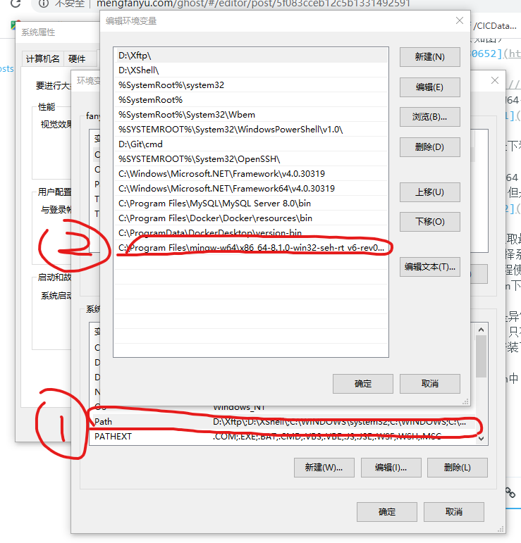
- 如图，先编辑path
- 然后将安装目录的bin添加到path中，我的路径为
> C:\Program Files\mingw-w64\x86_64-8.1.0-win32-seh-rt_v6-rev0\mingw64\bin
#### 编辑vscode
- 在vscode中打开一个目录,然后添加到工作区，然后添加一个文件如test.cc，如图
工作区目前如下

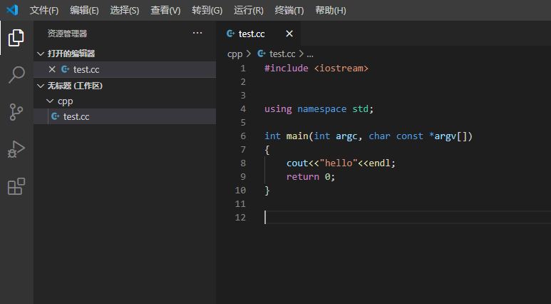
- 然后点击扩展，在搜索栏搜索c++，点击第一个，点击安装，如图所示

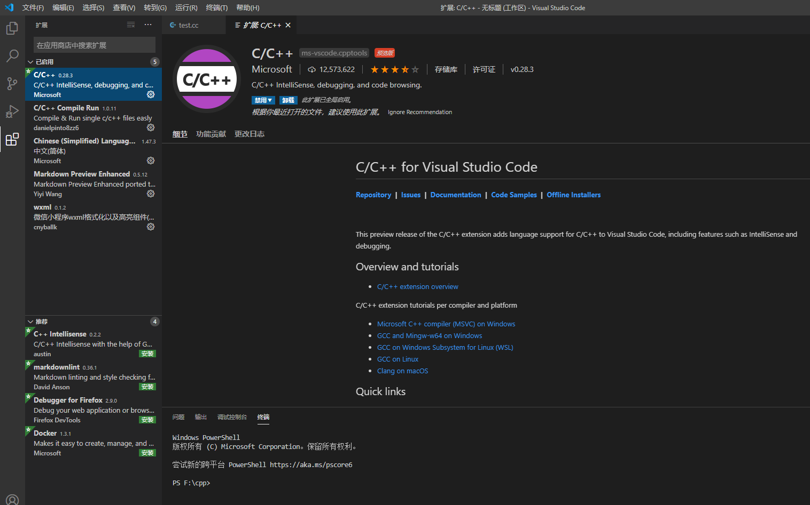
- 回到工作区，点击**终端**->**配置默认生成任务**

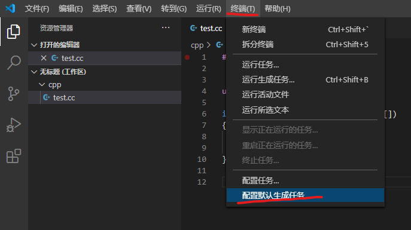
- 选择**g++.exe**

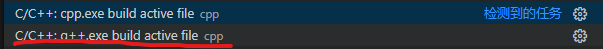
- 然后会生成一个新文件task.json，将文件内容都删去，将下面配置拷贝到task.json中
> 注：此处需要将command和cwd修改为自己的路径
``` json
{
  "version": "2.0.0",
  "tasks": [
    {
      "type": "shell",
      "label": "g++.exe build active file",
      "command": "C:\\mingw-w64\\i686-8.1.0-posix-dwarf-rt_v6-rev0\\mingw32\\bin\\g++.exe",//此处需要修改
      "args": ["-g", "${file}", "-o", "${fileDirname}\\${fileBasenameNoExtension}.exe"],
      "options": {
        "cwd": "C:\\mingw-w64\\i686-8.1.0-posix-dwarf-rt_v6-rev0\\mingw32\\bin"//此处需要修改
      },
      "problemMatcher": ["$gcc"],
      "group": {
        "kind": "build",
        "isDefault": true
      }
    }
  ]
}
```
- 我的电脑中配置后是这样

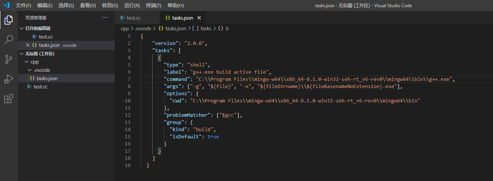
- 然后点击**运行**->**添加配置**，选择c++（gdb）

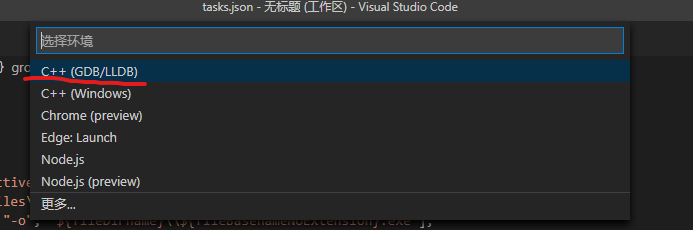
- 会自动生成launch.json
- 同样将下面的代码替换原来的内容
``` json
{
  "version": "0.2.0",
  "configurations": [
    {
      "name": "g++.exe build and debug active file",
      "type": "cppdbg",
      "request": "launch",
      "program": "${fileDirname}\\${fileBasenameNoExtension}.exe",
      "args": [],
      "stopAtEntry": false,
      "cwd": "${workspaceFolder}",
      "environment": [],
      "externalConsole": false,
      "MIMode": "gdb",
      "miDebuggerPath": "C:\\mingw-w64\\i686-8.1.0-posix-dwarf-rt_v6-rev0\\mingw32\\bin\\gdb.exe",//需要修改为自己的gdb路径
      "setupCommands": [
        {
          "description": "Enable pretty-printing for gdb",
          "text": "-enable-pretty-printing",
          "ignoreFailures": true
        }
      ],
      "preLaunchTask": "g++.exe build active file"
    }
  ]
}
```
- 我的修改后内容如下

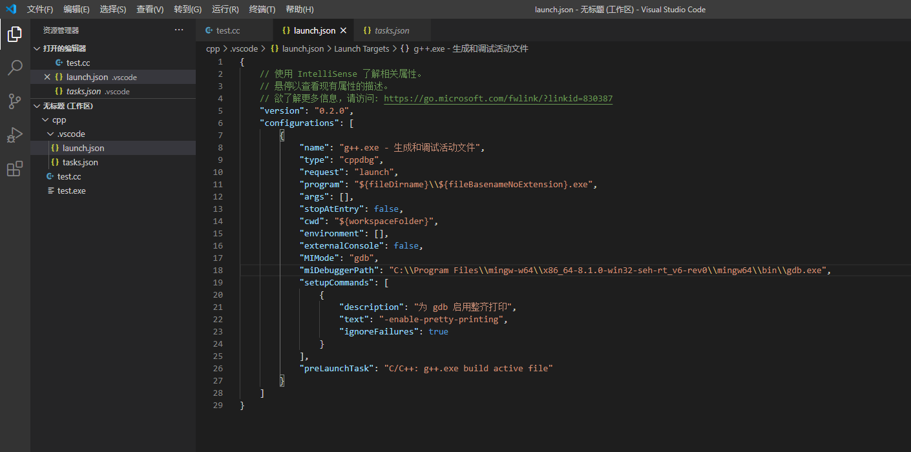

#### 结尾
- 到此，整个配置环节就结束了，下面就是运行了
- 点击**运行**->**调试**或**以非调试模式运行**就可以了

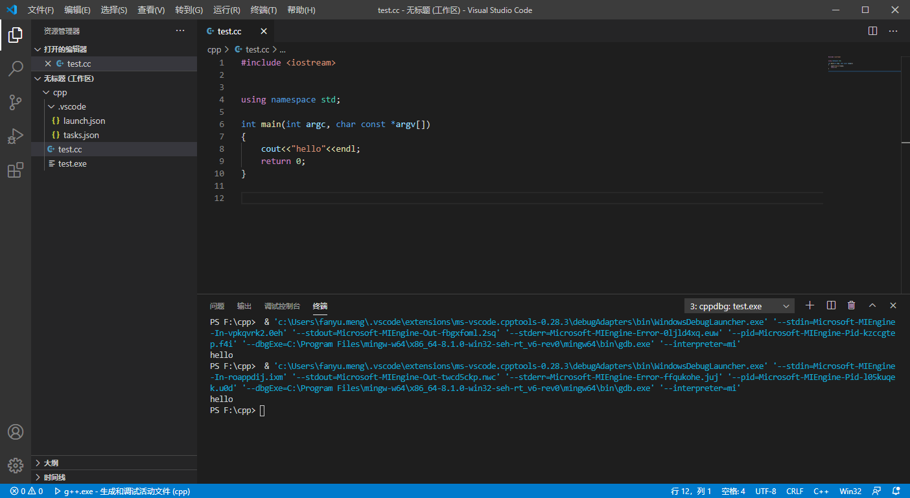

> 注：可能出现的问题
> 如果json文件有报错，可以在修改后将注释删除即可
> 就别在Windows下写多线程了
> 后期我会尽量再写linux和mac下的配置
